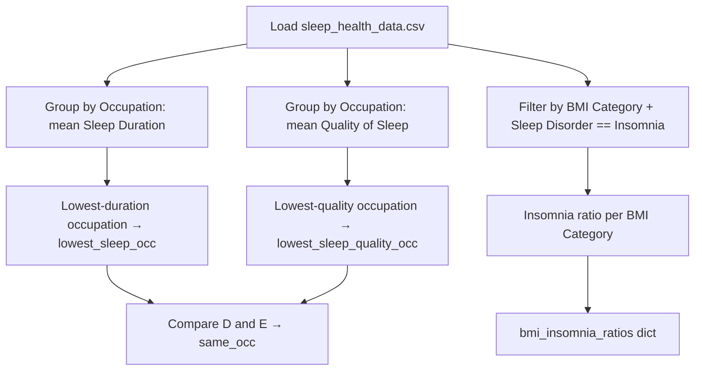

# Getting a Good Night's Sleep

This is a solved DataCamp guided project ("Getting a Good Night's Sleep," Basic skill level,
Data Manipulation & Exploratory Data Analysis track, prerequisite: *Data Manipulation with
pandas*). The scenario: a fictional sleep-tracking startup, SleepInc, shares six-month-averaged
sleep and lifestyle data from its SleepScope app for 374 users, and the task is to answer three
specific questions about the data using pandas.

## The three questions this notebook answers

1. Which occupation has the lowest average sleep duration? (`lowest_sleep_occ`)
2. Which occupation has the lowest average sleep quality, and is it the same occupation as #1?
   (`lowest_sleep_quality_occ`, `same_occ`)
3. What ratio of users in each BMI category (`Normal`, `Overweight`, `Obese`) have been
   diagnosed with Insomnia? (`bmi_insomnia_ratios`)

That's the full scope of the assignment — a single code cell answering exactly these three
questions, nothing broader.

## Dataset

`sleep_health_data.csv` — 374 rows, 13 columns: person ID, gender, age, occupation, sleep
duration, sleep quality, physical activity level, stress level, BMI category, blood pressure,
heart rate, daily steps, and sleep disorder. Values are six-month averages per user, supplied
as-is for the exercise (no license/source citation is included in the DataCamp prompt beyond
the fictional SleepInc/SleepScope scenario).

## Tech Stack & Methods

*Verified directly against `notebook.ipynb` (3 cells: 2 markdown, 1 code) and
`sleep_health_data.csv`.*

- **Language:** Python 3, single Jupyter notebook, authored in DataCamp Workspaces.
- **Data & Analysis Libraries:** `pandas` only — `pd.read_csv`, `.groupby()`, `.mean()`,
  `.sort_values()`, and boolean-mask filtering. (`pd` is supplied implicitly by the DataCamp
  environment; there's no explicit `import pandas as pd` line.)
- **Statistical Analysis:** descriptive only, matching the assignment's scope — grouped means
  (sleep duration and sleep quality by occupation, each reduced to the lowest-scoring
  occupation) and a simple proportion calculation (Insomnia diagnoses per BMI category). No
  correlation, hypothesis testing, or regression is part of this exercise.
- **Machine Learning:** not part of this project.
- **Tools & Development:** Jupyter Notebook (DataCamp Workspaces), Git/GitHub for version
  control.
- **Project Workflow:**

Load CSV → group by occupation (sleep duration & sleep quality) → identify the lowest-scoring
occupation on each → compare → filter by BMI category and Insomnia diagnosis → compute the
per-category ratio → store in a dict.

## Notes

A few small code-level things worth knowing, not gaps in the assignment itself:

- The code computes a `normal2` filter for `BMI Category == "Normal Weight"`, but that value
  never appears in this dataset (only `"Normal"` does), so `normal2` is always empty and unused
  — harmless dead code, left over from handling a category label that another version of this
  dataset uses.
- The code cell has no saved outputs committed (`outputs: []`), so the three result values
  (`lowest_sleep_occ`, `same_occ`, `bmi_insomnia_ratios`) aren't visible without re-running it.
- The `insomnia.jpg` image referenced in the first markdown cell isn't included in the repo, so
  that link renders broken.
